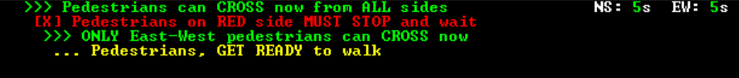
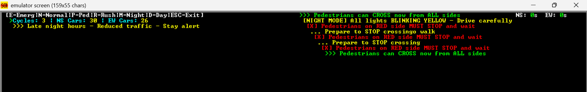
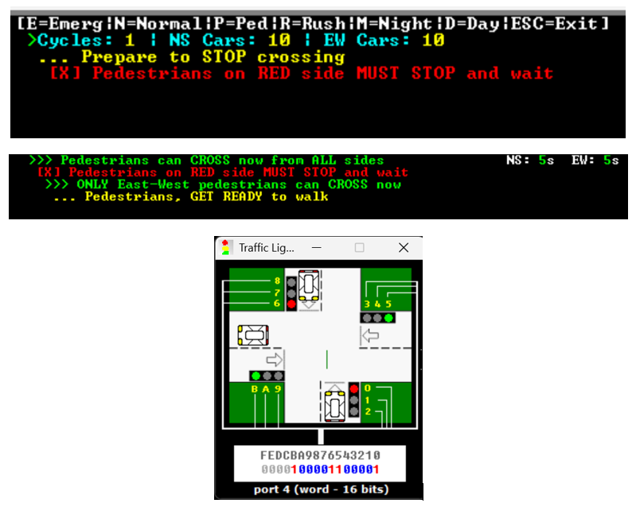
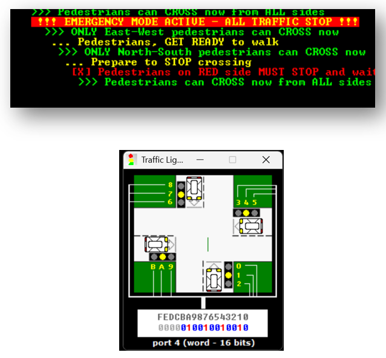
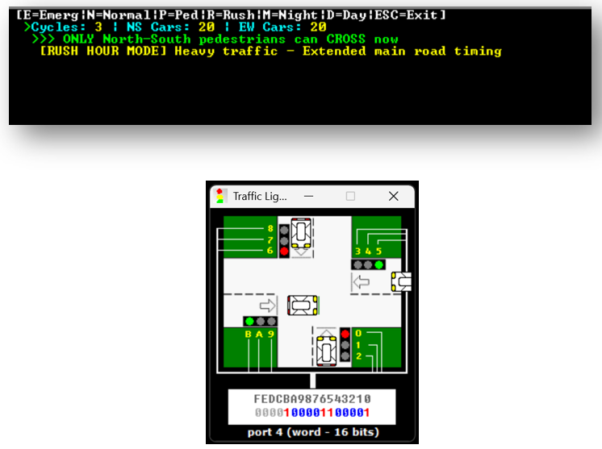
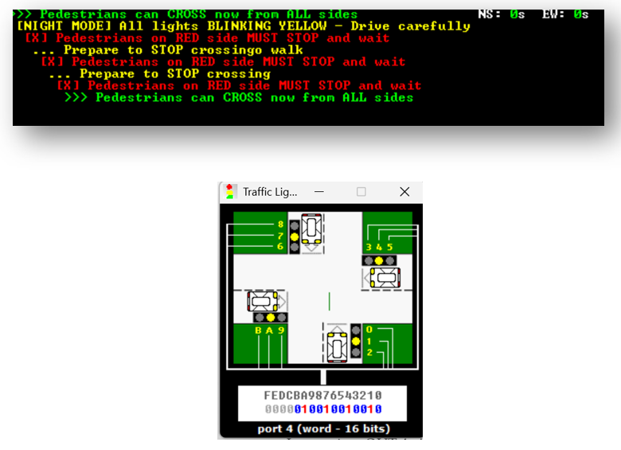

# 🚦 Traffic Light Control System - Assembly Language Implementation

<div align="center">


**An Intelligent Intersection Management System Built with x86 Assembly Language**

[](.)
[](.)
[](.)

[📖 Overview](#-overview) • [🎯 Features](#-system-features) • [🚀 Modes](#-operational-modes) 

</div>

---

## 📖 Overview

**Traffic Light Control System** is a comprehensive intersection management solution that demonstrates real-world traffic control principles using low-level programming. This project showcases the power of Assembly language in creating intelligent, responsive systems with multiple operational modes and safety features.

### 🎯 What is this project?

This is an **intelligent 4-way intersection traffic control system** implemented in x86 Assembly Language that:
- ✅ **Manages traffic flow** at four-way intersections (North-South & East-West)
- ✅ **Ensures pedestrian safety** with dedicated crossing phases
- ✅ **Adapts to conditions** with multiple operational modes
- ✅ **Responds to emergencies** with instant override capabilities
- ✅ **Monitors performance** with real-time statistics and timers

### 🔧 Development Environment

<div align="center">

| Component | Details |
|-----------|---------|
| **Language** | x86 Assembly (8086) |
| **Assembler** | MASM/TASM |
| **Platform** | DOSBox Emulator |
| **Memory Model** | Small (.model small) |
| **Hardware I/O** | Port 4 Communication |

</div>

---

## 📚 Table of Contents

- [🎯 System Features](#-system-features)
  - [Core Traffic Control](#-core-traffic-control)
  - [Real-Time Monitoring](#-real-time-monitoring)
  - [Pedestrian Safety](#-pedestrian-safety-system)
- [🚀 Operational Modes](#-operational-modes)
  - [Normal Mode](#1-normal-mode)
  - [Emergency Mode](#2-emergency-mode-press-e)
  - [Rush Hour Mode](#3-rush-hour-mode-press-r)
  - [Night Mode](#4-night-mode-press-m)
- [⚙️ Technical Implementation](#️-technical-implementation)
  - [Hardware Interface](#-hardware-interface)
  - [Signal Patterns](#-signal-patterns)
  - [Video Memory Management](#-video-memory-management)
  - [Timing System](#️-timing-system)
- [🎮 User Controls](#-user-controls--interface)
- [🏗️ System Architecture](#️-system-architecture)
- [🧪 Testing & Results](#-testing--results)
- [📝 Quick Reference](#-quick-reference)

---

## 🎯 System Features

### 🚦 Core Traffic Control

<div align="center">

| Feature | Description |
|---------|-------------|
| **Multi-Directional** | Independent North-South & East-West control |
| **Synchronized Transitions** | Safe signal changes with yellow warnings |
| **All-Red Clearance** | 5-second safety interval between cycles |
| **Hardware Output** | Binary pattern output to Port 4 |

</div>

#### 🔄 Signal States Flow:

```
┌──────────────┐
│   NS Green   │ → North-South vehicles GO
│   EW Red     │ → East-West vehicles STOP
└──────────────┘
        ↓
┌──────────────┐
│  All Yellow  │ → CAUTION: Prepare to stop
└──────────────┘
        ↓
┌──────────────┐
│   EW Green   │ → East-West vehicles GO
│   NS Red     │ → North-South vehicles STOP
└──────────────┘
        ↓
┌──────────────┐
│  All Yellow  │ → CAUTION: Prepare to stop
└──────────────┘
        ↓
┌──────────────┐
│   All Red    │ → Intersection clearance
│              │ → All pedestrians can CROSS
└──────────────┘
```

---

### 📊 Real-Time Monitoring

#### Live Countdown Timers

<p align="center">
  
</p>

**Display Format:** `NS: 5s  EW: 5s` (Top-right corner)

- ⏱️ **Updates every second** during active phases
- 🟢 **Color-coded in green** (0Ah) for visibility
- 📍 **Position:** Row 1, dynamically updated
- 🎯 **Shows remaining time** for each direction

#### Statistics Dashboard

<p align="center">
  
</p>

**Tracked Metrics:**

| Metric | Description | Calculation |
|--------|-------------|-------------|
| **Cycle Counter** | Total complete cycles | Increments each full cycle |
| **NS Cars** | North-South vehicles | 2 cars/second × green time |
| **EW Cars** | East-West vehicles | 2 cars/second × green time |

**Traffic Flow Model:**
```
Vehicles Passed = Green Time (seconds) × 2 cars/second

Example:
5 seconds green → 10 cars pass
8 seconds green → 16 cars pass
```

---

### 🚶 Pedestrian Safety System

#### 🎯 Direction-Specific Signals

<div align="center">

| Phase | Pedestrian Message | Color | Status |
|-------|-------------------|-------|--------|
| **All Red** | "Pedestrians can CROSS from ALL sides" | 🟢 Green | ✅ Safe |
| **NS Green** | "ONLY North-South pedestrians can CROSS" | 🟢 Green | ✅ Safe |
| **EW Green** | "ONLY East-West pedestrians can CROSS" | 🟢 Green | ✅ Safe |
| **Yellow** | "Prepare to STOP crossing" | 🟡 Yellow | ⚠️ Caution |
| **Wrong Side** | "Pedestrians MUST STOP and wait" | 🔴 Red | ❌ Stop |

</div>

#### 🚶‍♂️ Manual Crossing Request (Press 'P')

**How it works:**

1. **Press 'P'** during any traffic phase
2. **System validates** current phase
3. **Grants +3 seconds** if during green phase (Phase 1 or 3)
4. **Denies request** if during yellow/red/emergency

**Request Processing Logic:**

```
┌─────────────────────────┐
│  Pedestrian Presses 'P' │
└───────────┬─────────────┘
            │
    ┌───────▼────────┐
    │ Check Phase    │
    └───────┬────────┘
            │
    ┌───────▼─────────────────────────┐
    │ Is it NS Green or EW Green?     │
    └──┬────────────────────────┬─────┘
       │ YES                    │ NO
       │                        │
   ┌───▼────────┐         ┌────▼──────┐
   │ Grant +3s  │         │ Deny      │
   │ Extension  │         │ Request   │
   └────────────┘         └───────────┘
```

**Visual Feedback:**

- ✅ **Granted:** `[+3s] Extra time granted for pedestrians` (Yellow)
- ❌ **Denied:** `[!] Pedestrian request denied (wrong phase)` (Red)
- 📢 **Audio:** Beep confirmation for all requests

---

## 🚀 Operational Modes

### 1️⃣ Normal Mode

<p align="center">
  
</p>

**Default Operating Mode**

#### ⏱️ Timing Configuration:

| Phase | Duration | Description |
|-------|----------|-------------|
| **NS Green** | 5 seconds | North-South GO |
| **EW Green** | 5 seconds | East-West GO |
| **Yellow** | 2 seconds | Transition warning |
| **All Red** | 5 seconds | Safety clearance |
| **Total Cycle** | **19 seconds** | Complete cycle time |

#### 📈 Performance Metrics:

- **Throughput:** 10 cars (NS) + 10 cars (EW) = **20 vehicles/cycle**
- **Hourly Capacity:** ~3,789 vehicles/hour (balanced flow)
- **Balance:** Equal priority for both directions

---

### 2️⃣ Emergency Mode (Press 'E')

<p align="center">
  
</p>

**Immediate Response for Emergency Vehicles**

#### 🚨 Behavior:

```
🔔 All lights flash YELLOW (0.5s interval)
🔊 Continuous audio beeping
⚠️  Display: "!!! EMERGENCY MODE ACTIVE - ALL TRAFFIC STOP !!!"
⏸️  Timers reset to 0 seconds
```

#### 🚗 Traffic Protocol:

1. **All vehicles STOP immediately**
2. **Clear intersection** for emergency vehicles
3. **Proceed with extreme caution** when clear
4. **Press 'N'** to return to previous mode

#### 🔄 Mode Preservation:

```assembly
; System remembers previous mode
Before Emergency: Normal Mode
During Emergency: Flashing Yellow
After Exit: Returns to Normal Mode

Before Emergency: Night Mode  
During Emergency: Flashing Yellow
After Exit: Returns to Night Mode
```

---

### 3️⃣ Rush Hour Mode (Press 'R')

<p align="center">
  
</p>

**Optimize Heavy Traffic on Main Roads**

#### ⏱️ Timing Comparison:

<div align="center">

| Direction | Normal Mode | Rush Hour Mode | Change |
|-----------|-------------|----------------|--------|
| **NS Green** (Main) | 5s | **8s** | +60% ⬆️ |
| **EW Green** (Side) | 5s | **3s** | -40% ⬇️ |
| **Yellow** | 2s | **3s** | +50% ⬆️ |

</div>

#### 📊 Impact Analysis:

**Before Rush Hour (Normal):**
```
NS: 5s green → 10 cars/cycle
EW: 5s green → 10 cars/cycle
Total: 20 cars/cycle
```

**During Rush Hour:**
```
NS: 8s green → 16 cars/cycle  (+60%)
EW: 3s green → 6 cars/cycle   (-40%)
Total: 22 cars/cycle          (+10%)
```

#### 🎯 Use Cases:

- ⏰ **Morning Rush (7-9 AM):** Main road to city center
- 🌆 **Evening Rush (5-7 PM):** Main road from city center
- 🏢 **Business Districts:** Higher main road priority
- 🎉 **Events:** Manage heavy flow on primary routes

**Toggle:** Press 'R' again to disable and return to normal timing

---

### 4️⃣ Night Mode (Press 'M')

<p align="center">
  
</p>

**Low-Traffic Late-Night Operation**

#### 💡 Behavior:

```
🟡 All lights blink YELLOW
⏱️  Blink rate: 1 second ON/OFF
📺 Display: "[NIGHT MODE] All lights BLINKING YELLOW"
⏸️  Timers show: 0 seconds
```

#### 🚗 Traffic Rules:

1. **Treat as all-way stop** intersection
2. **Come to complete stop** at intersection
3. **Proceed when safe** - check all directions
4. **Reduces unnecessary waiting** during low traffic

#### 📅 Recommended Hours:

| Time Period | Mode | Reason |
|-------------|------|--------|
| 22:00 - 06:00 | Night Mode | Low traffic volume |
| 06:00 - 22:00 | Normal/Rush | Active traffic hours |

**Exit:** Press 'D' to return to day mode (Normal operation)

---

## ⚙️ Technical Implementation

### 🔌 Hardware Interface

#### Port Communication

**Output Port:** Port 4  
**Data Format:** 16-bit binary pattern  
**Assembly Instruction:** `OUT 4, AX`

#### 16-Bit Pattern Structure:

```
      North    South    East     West
    ┌────────┬────────┬────────┬────────┐
    │ RYG    │ RYG    │ RYG    │ RYG    │
    └────────┴────────┴────────┴────────┘
Bits: 11-9     8-6      5-3      2-0

Legend:
R = Red Light (Bit)
Y = Yellow Light (Bit)
G = Green Light (Bit)

Example: 0000_0011_0000_1100b
         │    │   │    │
         │    │   │    └─ North: Green ON
         │    │   └────── South: Green ON  
         │    └────────── East: Red ON
         └─────────────── West: Red ON
```

---

### 🚥 Signal Patterns

<div align="center">

| State | Binary Code | Hex | Description |
|-------|-------------|-----|-------------|
| **NS Green** | `0000_0011_0000_1100b` | `030Ch` | NS GO, EW STOP |
| **EW Green** | `0000_1000_0110_0001b` | `0861h` | EW GO, NS STOP |
| **All Yellow** | `0000_0100_1001_0010b` | `0492h` | WARNING |
| **All Red** | `0000_0010_0100_1001b` | `0249h` | STOP ALL |
| **Emergency** | `0000_0100_1001_0010b` | `0492h` | Flash Yellow |
| **Night** | `0000_0100_1001_0010b` | `0492h` | Blink Yellow |

</div>

#### Assembly Code Example:

```assembly
; Send NS Green signal to Port 4
mov ax, transition1        ; 0000_0011_0000_1100b
out 4, ax                  ; Output to hardware port

; Traffic lights will display:
; North: Green ON, Yellow OFF, Red OFF
; South: Green ON, Yellow OFF, Red OFF
; East:  Green OFF, Yellow OFF, Red ON
; West:  Green OFF, Yellow OFF, Red ON
```

---

### 🖥️ Video Memory Management

#### Direct Memory Access

**Segment Address:** `0xB800h`  
**Display Mode:** 80×25 text mode  
**Format:** Each character = 2 bytes (ASCII + Attribute)

#### Memory Layout:

```
┌────────────────────────────────────────┐
│ Byte 1: ASCII Character Code           │
│ Byte 2: Color Attribute                │
├────────────────────────────────────────┤
│ Offset = (Row × 160) + (Column × 2)    │
└────────────────────────────────────────┘

Example: Writing 'A' in Green at Row 5, Col 10
Offset = (5 × 160) + (10 × 2) = 820
Memory[0xB800:820] = 'A'    ; ASCII
Memory[0xB800:821] = 0Ah    ; Green color
```

#### Color Attributes:

<div align="center">

| Code | Color | Usage |
|------|-------|-------|
| **0Ah** | 🟢 Light Green | Timers, positive messages |
| **0Bh** | 🔵 Cyan | Statistics, information |
| **0Ch** | 🔴 Light Red | Warnings, stop signals |
| **0Eh** | 🟡 Yellow | Cautions, rush hour |
| **0Fh** | ⚪ White | General text, help |
| **0CEh** | 🔴🟡 Red on Yellow | Emergency alert |

</div>

#### Implementation Example:

```assembly
PrintTextColor:
    mov ax, 0B800h
    mov es, ax              ; ES = Video segment
    
    ; Calculate offset
    mov ax, row
    mov dx, 160
    mul dx                  ; AX = row × 160
    mov di, ax              ; DI = offset
    
print_loop:
    lodsb                   ; Load character from SI
    cmp al, 0               ; Check for null terminator
    je done
    mov es:[di], al         ; Write ASCII to video memory
    inc di
    mov es:[di], bl         ; Write color attribute
    inc di
    jmp print_loop
done:
    ret
```

---

### ⏱️ Timing System

#### BIOS Interrupt 15h (Microsecond Delay)

**Function:** `AH = 86h`  
**Parameters:**
- `CX:DX` = Microseconds to delay
- `AL = 0` (Critical for DOSBox compatibility)

#### 1-Second Delay Implementation:

```assembly
; Delay for exactly 1 second (1,000,000 microseconds)
DelayOneSecond:
    mov al, 0           ; CRITICAL FIX for DOSBox
    mov cx, 000Fh       ; High word (15)
    mov dx, 4240h       ; Low word (16960)
    mov ah, 86h         ; Microsecond delay function
    int 15h             ; Execute BIOS interrupt
    ret

; Calculation:
; CX:DX = 0x000F4240 = 1,000,000 microseconds = 1 second
```

#### Custom Delay Procedures:

| Procedure | Purpose | Features |
|-----------|---------|----------|
| **DelayWithCountdown** | All-red phase | Beeps each second, countdown display |
| **DelayWithLiveTimer** | Green phases | Updates NS or EW timer dynamically |
| **DelayWithBothTimers** | Yellow phases | Updates both timers simultaneously |

#### Example: Live Timer Countdown

```assembly
DelayWithLiveTimer:
    mov bx, cx          ; BX = seconds remaining
    
delay_loop:
    cmp bx, 0
    je done
    
    ; Update timer display
    cmp current_phase, 1
    je update_ns
    mov ew_timer, bl    ; Update EW timer
    jmp display
    
update_ns:
    mov ns_timer, bl    ; Update NS timer
    
display:
    call UpdateTimerDisplay
    
    ; Delay 1 second
    mov al, 0
    mov cx, 000Fh
    mov dx, 4240h
    mov ah, 86h
    int 15h
    
    ; Check for mode changes
    call CheckModeKeys
    
    dec bx
    jmp delay_loop
    
done:
    ret
```

---

## 🎮 User Controls & Interface

### ⌨️ Keyboard Commands

<div align="center">

| Key | Function | Description |
|-----|----------|-------------|
| **E** | Emergency | Activate emergency mode (instant) |
| **N** | Normal | Exit emergency, return to previous mode |
| **P** | Pedestrian | Request +3s crossing time |
| **R** | Rush Hour | Toggle rush hour mode (8s/3s timing) |
| **M** | Night | Activate night mode (blinking yellow) |
| **D** | Day | Exit night mode, return to normal |
| **ESC** | Exit | Terminate program gracefully |

</div>

**Features:**
- ✅ **Case-insensitive** (e/E both work)
- ✅ **Real-time detection** (INT 16h keyboard service)
- ✅ **Immediate response** (<100ms)
- ✅ **Mode validation** before switching

---

### 📺 Screen Layout

<p align="center">
  
</p>


**Layout Components:**

1. **Row 0:** Control keys help (always visible)
2. **Row 1:** Live statistics + countdown timers
3. **Rows 3-20:** Scrolling message display area
4. **Row 24:** Countdown display (bottom-right)

**Auto-Scrolling:**
- Messages scroll from Row 3 to Row 20
- Automatically resets to Row 3 when full
- Prevents overflow with boundary checking

---

## 🏗️ System Architecture

### 🔄 Program Flow

```
┌─────────────────┐
│ Initialization  │
│ - Clear screen  │
│ - Show help     │
│ - Init timers   │
└────────┬────────┘
         │
         ▼
┌─────────────────┐
│ All Red Phase   │
│ - 5 sec delay   │
│ - Beep countdown│
│ - Ped all GO    │
└────────┬────────┘
         │
         ▼
    ┌────────────────┐
    │   MAIN LOOP    │◄─────────┐
    │                │          │
    │ Check modes:   │          │
    │ - Emergency?   ├──►[Emergency Loop]
    │ - Night?       ├──►[Night Loop]
    │ - Exit?        ├──►[Exit Program]
    └────────┬───────┘          │
             │                  │
             ▼                  │
    ┌────────────────┐         │
    │  Traffic Cycle │         │
    │                │         │
    │ 1. NS Green    │         │
    │ 2. All Yellow  │         │
    │ 3. EW Green    │         │
    │ 4. All Yellow  │         │
    │ 5. All Red     │         │
    └────────┬───────┘         │
             │                  │
             └──────────────────┘
```

---

### 🔁 Phase Sequence (19-second cycle)

<div align="center">

| Time | Phase | NS Light | EW Light | Pedestrians | Cars Passing |
|------|-------|----------|----------|-------------|--------------|
| **0-5s** | All Red | 🔴 Red | 🔴 Red | ✅ ALL CROSS | None |
| **5-10s** | NS Green | 🟢 Green | 🔴 Red | ✅ NS CROSS | ~10 NS cars |
| **10-12s** | Yellow | 🟡 Yellow | 🟡 Yellow | ⚠️ PREPARE STOP | None |
| **12-17s** | EW Green | 🔴 Red | 🟢 Green | ✅ EW CROSS | ~10 EW cars |
| **17-19s** | Yellow | 🟡 Yellow | 🟡 Yellow | ⚠️ PREPARE WALK | None |

</div>

**Then cycle repeats...**

---

### 📊 Data Structures

#### Mode Flags (State Management):

```assembly
; Boolean flags (0 = inactive, 1 = active)
emergency_mode     db 0     ; Emergency override active?
night_mode         db 0     ; Night mode blinking?
rush_hour_mode     db 0     ; Extended timing active?
ped_request        db 0     ; Pedestrian requested crossing?
program_exit       db 0     ; User requested exit?
previous_mode      db 0     ; Mode before emergency (for return)
current_phase      db 0     ; 0=all_red, 1=NS_green, 2=yellow, 3=EW_green
```

#### Timers & Counters:

```assembly
; Current display values
ns_timer        db 0         ; North-South countdown (0-8)
ew_timer        db 0         ; East-West countdown (0-8)

; 16-bit statistics (max: 65,535)
cycle_counter   dw 0         ; Total cycles completed
ns_cars         dw 0         ; Total North-South vehicles
ew_cars         dw 0         ; Total East-West vehicles
```

#### Timing Configuration:

```assembly
; Modifiable by rush hour mode
ns_green_time   db 5         ; Default 5s (8s in rush hour)
ew_green_time   db 5         ; Default 5s (3s in rush hour)
yellow_time     db 2         ; Default 2s (3s in rush hour)

; Working storage
current_timer_value db 0     ; Active countdown value
```

---
## 📝 Quick Reference

### 🔧 Assembly Instructions Used

#### Port I/O:
```assembly
OUT 4, AX          ; Output traffic pattern to hardware port 4
```

#### BIOS Interrupts:

| Interrupt | Function | Purpose |
|-----------|----------|---------|
| **INT 10h** | `AH=06h` | Scroll screen / Clear screen |
| | `AH=02h` | Set cursor position |
| | `AH=0Eh` | Write character + beep |
| **INT 15h** | `AH=86h` | Microsecond delay (timing) |
| **INT 16h** | `AH=01h` | Check keyboard status |
| | `AH=00h` | Read keyboard input |
| **INT 21h** | `AH=4Ch` | Program termination |

---

### 📊 Complete Timing Chart

#### Normal Mode (Default):

```
╔══════════════╦═══════════╦═════════╦══════════════════╗
║ Phase        ║ Duration  ║ Lights  ║ Pedestrians      ║
╠══════════════╬═══════════╬═════════╬══════════════════╣
║ All Red      ║ 5 sec     ║ 🔴🔴    ║ ✅ ALL CROSS     ║
║ NS Green     ║ 5 sec     ║ 🟢🔴    ║ ✅ NS CROSS      ║
║ Yellow       ║ 2 sec     ║ 🟡🟡    ║ ⚠️ PREPARE STOP  ║
║ EW Green     ║ 5 sec     ║ 🔴🟢    ║ ✅ EW CROSS      ║
║ Yellow       ║ 2 sec     ║ 🟡🟡    ║ ⚠️ PREPARE WALK  ║
╠══════════════╬═══════════╬═════════╬══════════════════╣
║ TOTAL CYCLE  ║ 19 sec    ║         ║ 20 cars/cycle    ║
╚══════════════╩═══════════╩═════════╩══════════════════╝
```

#### Rush Hour Mode:

```
╔══════════════╦═══════════╦═════════╦══════════════════╗
║ Phase        ║ Duration  ║ Lights  ║ Pedestrians      ║
╠══════════════╬═══════════╬═════════╬══════════════════╣
║ All Red      ║ 5 sec     ║ 🔴🔴    ║ ✅ ALL CROSS     ║
║ NS Green     ║ 8 sec ⬆️  ║ 🟢🔴    ║ ✅ NS CROSS      ║
║ Yellow       ║ 3 sec ⬆️  ║ 🟡🟡    ║ ⚠️ PREPARE STOP  ║
║ EW Green     ║ 3 sec ⬇️  ║ 🔴🟢    ║ ✅ EW CROSS      ║
║ Yellow       ║ 3 sec ⬆️  ║ 🟡🟡    ║ ⚠️ PREPARE WALK  ║
╠══════════════╬═══════════╬═════════╬══════════════════╣
║ TOTAL CYCLE  ║ 22 sec    ║         ║ 22 cars/cycle    ║
╚══════════════╩═══════════╩═════════╩══════════════════╝
```

---

### 🎯 Code Structure Map

```
Traffic_Lights.asm
│
├── .data Section
│   ├── Messages (pedestrian, emergency, mode)
│   ├── Signal Patterns (transition1-4, all_red, emergency)
│   ├── Configuration Variables (timers, counters)
│   └── Screen Management (offsets, flags)
│
├── .code Section
│   │
│   ├── Main Control
│   │   ├── start: Program initialization
│   │   ├── main_loop: Primary traffic cycle
│   │   ├── emergency_loop: Emergency mode handler
│   │   └── night_loop: Night mode handler
│   │
│   ├── Input Processing
│   │   ├── CheckModeKeys: Keyboard input detection
│   │   └── Mode switching logic
│   │
│   ├── Display Functions
│   │   ├── PrintTextColor: Colored message output
│   │   ├── UpdateTimerDisplay: Live countdown rendering
│   │   ├── UpdateStatistics: Stats dashboard
│   │   ├── PrintDigitToScreen: Single digit display
│   │   ├── PrintNumberToScreen: Multi-digit numbers
│   │   ├── ClearScreen: Full screen clear
│   │   └── ClearMessageArea: Message area reset
│   │
│   ├── Timing Functions
│   │   ├── DelayWithCountdown: Beeping countdown
│   │   ├── DelayWithLiveTimer: Single timer countdown
│   │   └── DelayWithBothTimers: Dual timer update
│   │
│   └── System Functions
│       └── exit_program: Clean termination
```

---

### 🐛 Troubleshooting Guide

#### Common Issues & Solutions:

| Problem | Cause | Solution |
|---------|-------|----------|
| **Timing not working** | INT 15h failure | Add `MOV AL, 0` before INT 15h |
| **Counter overflow** | 8-bit multiplication | Use 16-bit: `XOR AH, AH; MUL BX` |
| **Display overflow** | No boundary check | Add: `CMP AX, max_row; JL screen_ok` |
| **Mode doesn't return** | State not saved | Save `previous_mode` before emergency |
| **Timers not updating** | Wrong phase check | Verify `current_phase` value |
| **Statistics incorrect** | Wrong calculation | Use: `time × 2 cars/sec` |

---

## 🎓 Key Learning Outcomes

### ✅ Technical Skills Mastered:

1. **Assembly Language Programming**
   - x86 instruction set (8086)
   - Register manipulation (AX, BX, CX, DX, SI, DI)
   - Memory addressing modes
   - Stack operations (PUSH/POP)

2. **Hardware Interface**
   - Port I/O communication (OUT instruction)
   - Binary pattern encoding
   - Hardware control simulation
   - Real-time signal generation

3. **Low-Level System Design**
   - Direct video memory access (0xB800h)
   - BIOS interrupt handling (INT 10h, 15h, 16h, 21h)
   - Non-blocking keyboard input
   - Precision timing mechanisms

4. **State Machine Logic**
   - Multi-state traffic control
   - Mode transitions and preservation
   - Phase sequencing
   - Event-driven programming

5. **Real-Time Systems**
   - Live timer updates
   - Concurrent input processing
   - Responsive user interface
   - Performance monitoring

### 🚀 Software Engineering Concepts:

- ✅ **Modular Design:** Reusable procedures and clean separation
- ✅ **Error Handling:** Boundary checks and overflow prevention
- ✅ **User Experience:** Intuitive controls and visual feedback
- ✅ **Documentation:** Comprehensive code comments
- ✅ **Testing:** Systematic validation of all features

---

## 📚 Project Documentation

### 📄 Included Files:

| File | Description |
|------|-------------|
| `Traffic_Lights.asm` | Complete assembly source code |
| `TRAFFIC_LIGHT_CONTROL_SYSTEM.pdf` | Detailed technical report |
| `Traffic-Lights-Proposal.pdf` | Project proposal and specifications |
| `README.md` | This comprehensive guide |

### 📖 Additional Resources:

- [x86 Assembly Language Reference](https://www.felixcloutier.com/x86/)
- [BIOS Interrupt List](http://www.ctyme.com/intr/int.htm)
- [DOSBox Documentation](https://www.dosbox.com/wiki/Main_Page)
- [Traffic Light Engineering Principles](https://mutcd.fhwa.dot.gov/)

---

---

## 📞 Connect With Us

<div align="center">

[](mailto:a.wahid7860668@gmail.com)
[](https://www.linkedin.com/in/abdul-wahid022)
[](https://github.com/abdul-wahid022)

**💬 Questions? Need the assembly code? Feel free to reach out!**

</div>

---

## 🎯 Future Enhancements

### Potential Improvements:

1. **🚶‍♂️ Advanced Pedestrian Features**
   - Countdown timers for pedestrians
   - Audio crossing signals (beeping pattern)
   - Multiple pedestrian crossing points

2. **📊 Enhanced Statistics**
   - Average wait time calculation
   - Peak hour analysis
   - Traffic flow optimization metrics

3. **🎨 Visual Improvements**
   - Graphical traffic light display
   - Real-time intersection diagram
   - Color-coded traffic flow visualization

4. **🤖 Smart Features**
   - Traffic density sensors simulation
   - Adaptive timing based on vehicle count
   - Machine learning for optimal timing

5. **🌐 Network Capabilities**
   - Multiple intersection coordination
   - Centralized traffic control
   - Emergency vehicle priority routing

---

## 📄 License

This project is created for **educational purposes** as part of the Computer Organization & Assembly Language course.

**License:** Open-source for educational use  
**Usage:** Feel free to learn from, modify, and share with attribution

---

---

<div align="center">

### ⭐ If you found this project helpful, please give it a star!

**Made by Abdul Wahid**

*Computer Organization & Assembly Language Project*  
*Last Updated: January 2026*

---

### 🚦 "Controlling Traffic, One Assembly Instruction at a Time" 🚦

</div>
